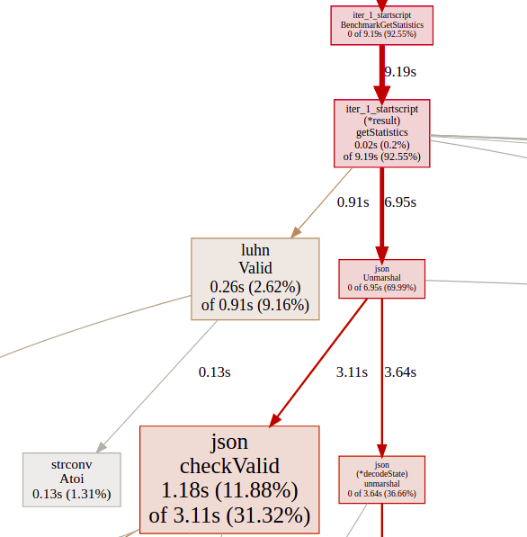
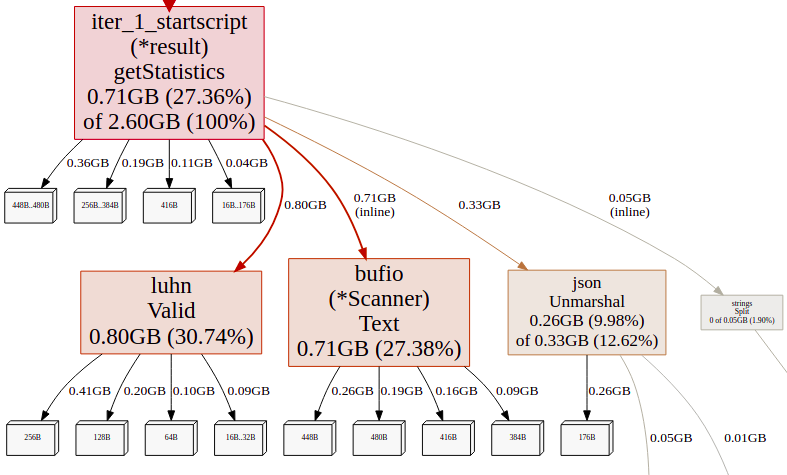
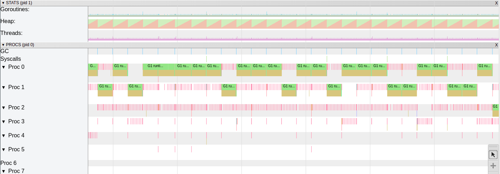

# Start Script

Run Time:

```bash
$ time ./iter_1_startscript
There are 169257, out of 1708337, valid Luhn numbers. 
United States has the biggest # of visitors, with 717217 of hits. 
Europe is the continent with most unique countries that accessed the site more than 1000 times. It has 33 unique countries. 

real	0m8,713s
user	0m9,213s
sys	    0m0,319s
```

Benchmarks:

```bash
$ go test -bench GetStatistics -cpuprofile cpu.pprof
goos: linux
goarch: amd64
pkg: github.com/Danr17/dev-state_blog_code/tree/master/diagnose_go_code/iter_1_startscript
BenchmarkGetStatistics-8   	       1	9367019288 ns/op
PASS
ok  	github.com/Danr17/dev-state_blog_code/tree/master/diagnose_go_code/iter_1_startscript	9.538s

########

$ go test -bench GetStatistics -memprofile mem.pprof -benchmem
goos: linux
goarch: amd64
pkg: github.com/Danr17/dev-state_blog_code/tree/master/diagnose_go_code/iter_1_startscript
BenchmarkGetStatistics-8   	       1	9068461723 ns/op	2817476848 B/op	25624358 allocs/op
PASS
ok  	github.com/Danr17/dev-state_blog_code/tree/master/diagnose_go_code/iter_1_startscript	9.072s

```

CPU Profile:  


MEM Profile:  


Trace:  

