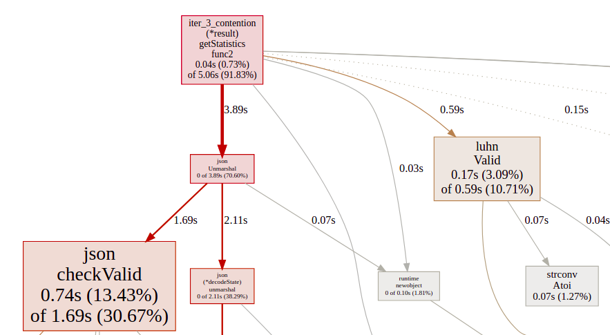
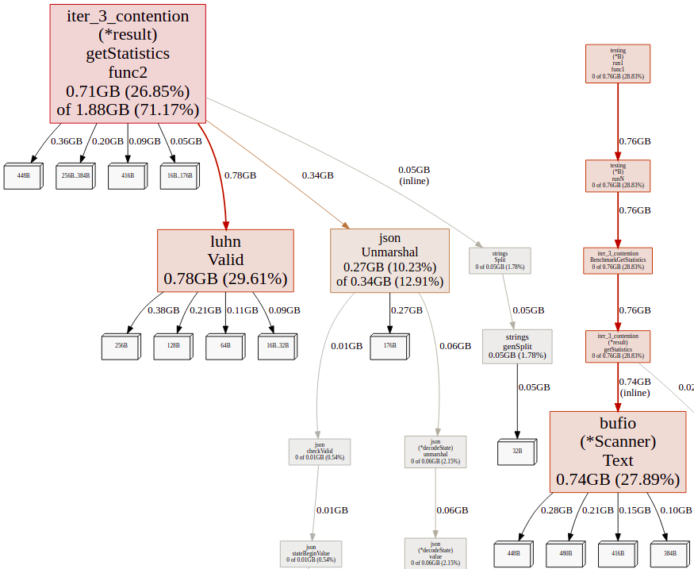
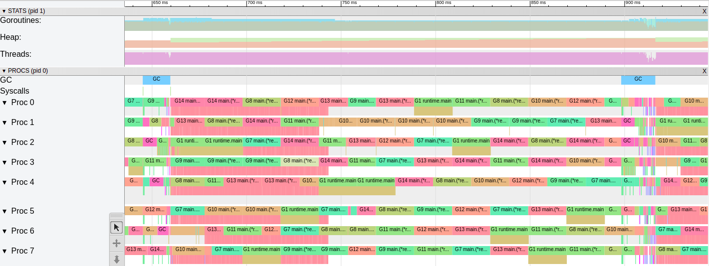
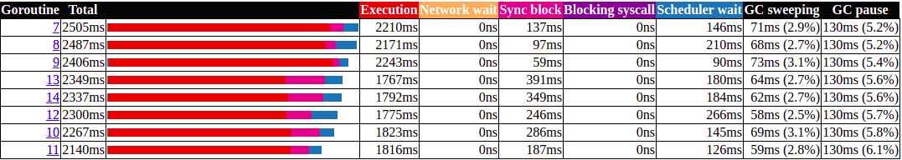

# Remove Contention

Run Time:

```bash
$ time ./iter_3_contention
There are 169257, out of 1708337, valid Luhn numbers. 
United States has the biggest # of visitors, with 717217 of hits. 
Europe is the continent with most unique countries that accessed the site more than 1000 times. It has 33 unique countries. 

real	0m2,153s
user	0m14,152s
sys	    0m0,670s
```

Benchmarks:

```bash
$ go test -bench GetStatistics -cpuprofile cpu.pprof
goos: linux
goarch: amd64
pkg: github.com/Danr17/dev-state_blog_code/tree/master/diagnose_go_code/iter_3_contention
BenchmarkGetStatistics-8   	       1	2125320341 ns/op
PASS
ok  	github.com/Danr17/dev-state_blog_code/tree/master/diagnose_go_code/iter_3_contention	2.452s

########

$ go test -bench GetStatistics -memprofile mem.pprof -benchmem
goos: linux
goarch: amd64
pkg: github.com/Danr17/dev-state_blog_code/tree/master/diagnose_go_code/iter_3_contention
BenchmarkGetStatistics-8   	       1	2106188910 ns/op	2845736048 B/op	25685616 allocs/op
PASS
ok  	github.com/Danr17/dev-state_blog_code/tree/master/diagnose_go_code/iter_3_contention	2.255s
```

CPU Profile:


MEM Profile:


Trace:


Goroutine analysis:

