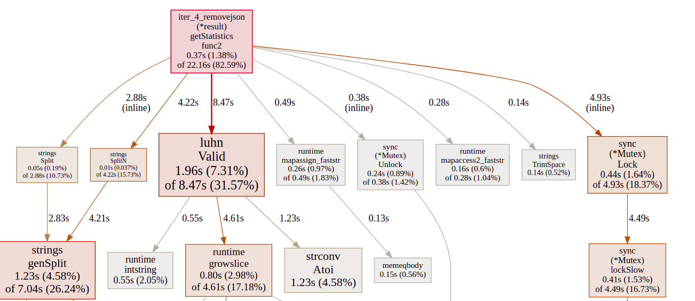
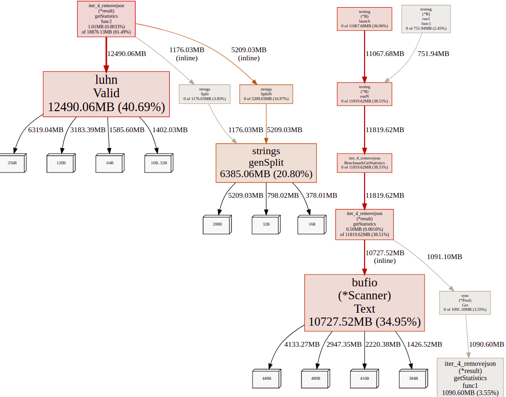
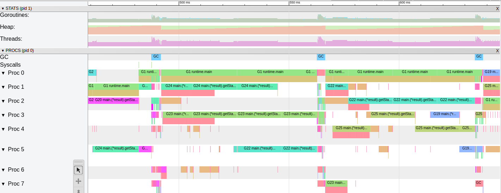
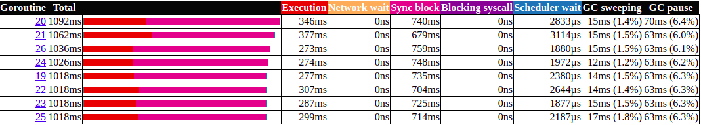

# Replace Json Unmarshall with strings.splitN()

Run Time:

```bash
$ time ./iter_4_removejson
There are 169257, out of 1708337, valid Luhn numbers. 
United States has the biggest # of visitors, with 717217 of hits. 
Europe is the continent with most unique countries that accessed the site more than 1000 times. It has 33 unique countries. 

real	0m0,829s
user	0m3,868s
sys	    0m0,381s
```

Benchmarks:

```bash
$ go test -bench GetStatistics -cpuprofile cpu.pprof
goos: linux
goarch: amd64
pkg: github.com/Danr17/dev-state_blog_code/tree/master/diagnose_go_code/iter_4_removejson
BenchmarkGetStatistics-8   	      64	  16201405 ns/op
PASS
ok  	github.com/Danr17/dev-state_blog_code/tree/master/diagnose_go_code/iter_4_removejson	11.731s

########

$ go test -bench GetStatistics -memprofile mem.pprof -benchmem
goos: linux
goarch: amd64
pkg: github.com/Danr17/dev-state_blog_code/tree/master/diagnose_go_code/iter_4_removejson
BenchmarkGetStatistics-8   	      84	  12098290 ns/op	27447364 B/op	  248510 allocs/op
PASS
ok  	github.com/Danr17/dev-state_blog_code/tree/master/diagnose_go_code/iter_4_removejson	13.709s
```

CPU Profile:


MEM Profile:


Trace:


Goroutine analysis:

