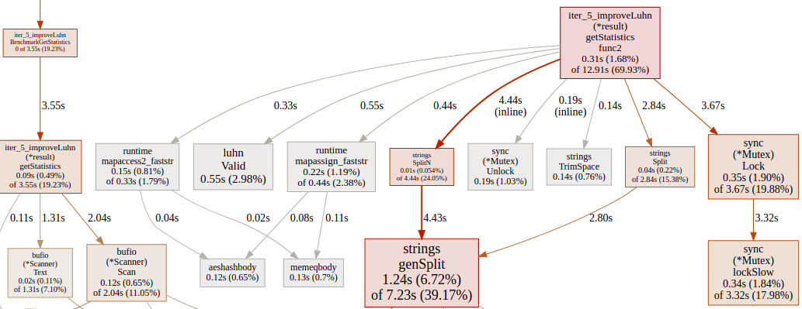
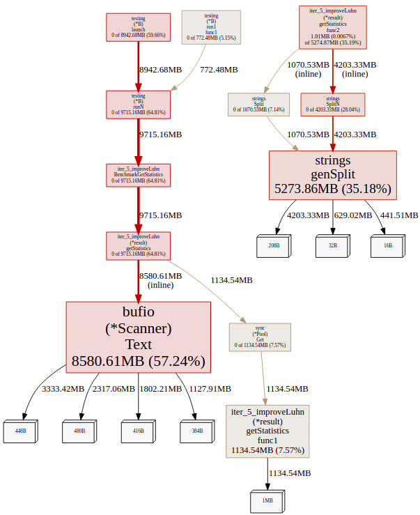
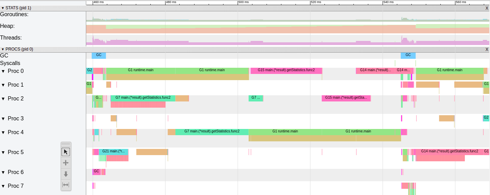
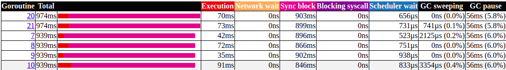

# Improve Luhn algorithm

Run Time:

```bash
$ time ./iter_5_improveLuhn
There are 169257, out of 1708337, valid Luhn numbers. 
United States has the biggest # of visitors, with 717217 of hits. 
Europe is the continent with most unique countries that accessed the site more than 1000 times. It has 33 unique countries. 

real	0m0,703s
user	0m2,030s
sys	    0m0,310s
```

Benchmarks:

```bash
$ go test -bench GetStatistics -cpuprofile cpu.pprof
goos: linux
goarch: amd64
pkg: github.com/Danr17/dev-state_blog_code/tree/master/diagnose_go_code/iter_5_improveLuhn
BenchmarkGetStatistics-8   	     118	   8545421 ns/op
PASS
ok  	github.com/Danr17/dev-state_blog_code/tree/master/diagnose_go_code/iter_5_improveLuhn	8.464s

########

$ go test -bench GetStatistics -memprofile mem.pprof -benchmem
goos: linux
goarch: amd64
pkg: github.com/Danr17/dev-state_blog_code/tree/master/diagnose_go_code/iter_5_improveLuhn
BenchmarkGetStatistics-8   	     129	   8273411 ns/op	12407446 B/op	  105717 allocs/op
PASS
ok  	github.com/Danr17/dev-state_blog_code/tree/master/diagnose_go_code/iter_5_improveLuhn	9.311s
```

Profiles and traces:





